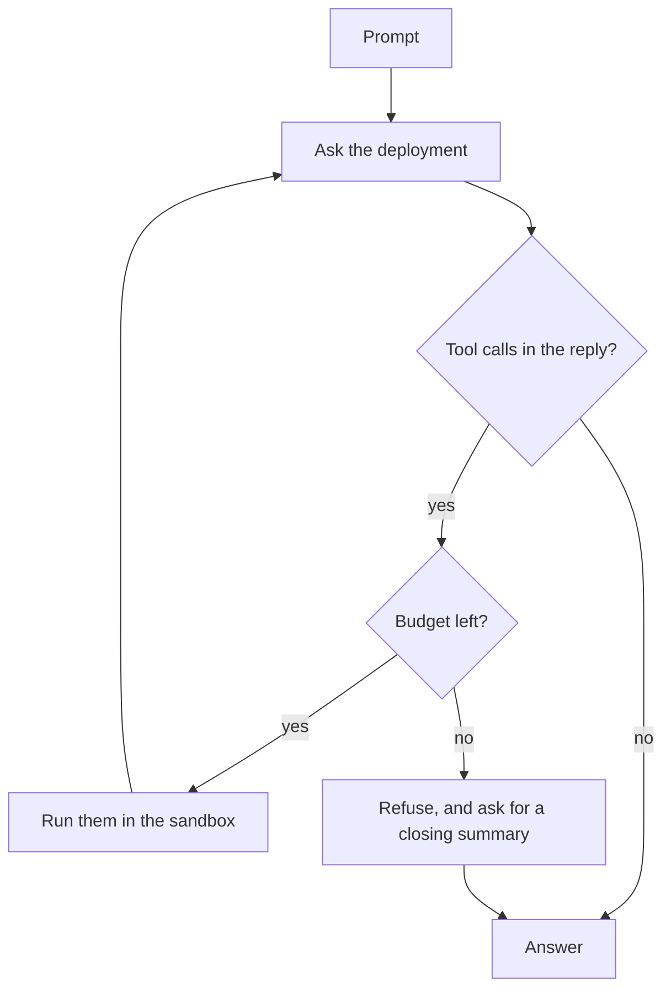
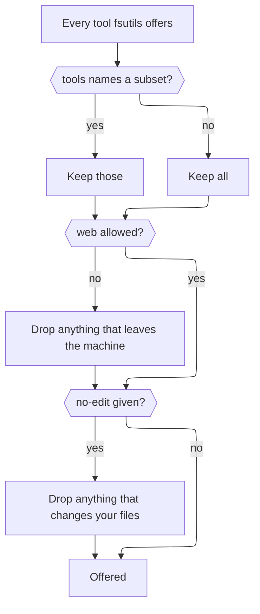

# cogiteer

A command-line cross-LLM session orchestrator. Start a conversation with one
provider, continue it with another, and keep the whole thing on disk in a
format neither provider owns.

> **WARNING**: This tool is a work in progress and in development until this warning is removed.

> See [DISCLOSURE](./DISCLOSURE.md) for information how AI is used by this project.

## The point

Every vendor stores a conversation in its own shape, so moving one between them
loses something — usually quietly. [`liaison`][liaison], the shard this tool is
built on, keeps the conversation in a canonical portable form and translates at
the edges, reporting what each handoff cost rather than pretending it was free.

`cogiteer` is that made usable from a terminal: one invocation, one call to a
provider, one saved result. Sessions live in files, so the conversation outlives
the process that started it and can be picked up on a different deployment
tomorrow.

## Verbs

```
cogiteer start <deployment> <prompt...> [--id <session-id>] [tool flags] [display flags]
cogiteer continue <session-id> <prompt...> [--on <deployment>] [tool flags] [display flags]
cogiteer list
cogiteer show <session-id> [--snapshots] [--json]
cogiteer prune <session-id> --keep <n>
cogiteer delete <session-id>
```

Verb                   |Does                                                       
-----------------------|-----------------------------------------------------------
`start <deployment>`   |Opens a session and takes the first turn on that deployment
`continue <session-id>`|Takes another turn, on whichever deployment last answered  
`list`                 |Every session, newest first                                
`show <session-id>`    |The conversation; `--snapshots` for the turn history       
`prune <session-id>`   |Drops all but the newest `--keep <n>` snapshots            
`delete <session-id>`  |Removes the session folder                                 

`list` and `show` touch no network at all.

```console
$ cogiteer start ollama "Name three things Vienna is known for."
Session: brisk-comet
Vienna is known for its coffee houses, its classical music, and the Ringstrasse.

$ cogiteer continue brisk-comet "Recommend one coffee house." --on anthropic
Café Sperl, for the billiard tables and the lack of hurry.
```

The second command is the whole pitch: a different vendor, a different wire
protocol, the same conversation. `continue` works out which deployment last
answered by reading it off the session itself, so `--on` is only needed when you
want to switch.

The reply is the only thing on stdout. Session ids, warnings and reasoning all
go to stderr, so `cogiteer start ... > answer.txt` gets an answer and nothing
else.

### Flags on `start` and `continue`

Both verbs take the same display and tool flags, and each overrides the
matching key under `defaults` for that one run.

Flag                                  |Does                                        
--------------------------------------|--------------------------------------------
`--stream`, `--no-stream`             |Show the reply as it arrives, or wait for it
`--show-reasoning`, `--hide-reasoning`|Put the model's thinking on stderr          
`--tools <a,b>`                       |Offer only these tools; empty offers none   
`--no-edit`                           |Drop every tool that changes your files     
`--web`, `--no-web`                   |Allow, or refuse, tools that reach the web  
`--max-tool-calls <n>`                |Ceiling for this turn; `0` offers no tools  
`--reproducible-tools`, `--no-…`      |Omit when and where a tool call ran         

`start` also takes `--id <session-id>` to name the session instead of taking a
generated one; `continue` takes `--on <deployment>` to switch deployment.

## Tools

A turn can read and edit files, and fetch a web page. The CLI offers the
[`fsutils`][fsutils] toolkit — `read_text_file`, `find_files`,
`search_file_contents`, `write_text_file` and `text_replace`, rooted at the
directory you ran it from, plus `fetch_as_markdown`, which is off unless you
ask for it — runs whatever the model calls, and feeds the results back until it
answers.

```console
$ cogiteer start ollama "Which spec covers the tool budget? Read before you answer." --no-edit
Session: candid-otter
spec/cogiteer/tools/tools_spec.cr — its second example caps the run at one call.
```

The loop, and where each control bites:



- **The sandbox is the working directory.** Every path a model supplies is
  resolved against it and compared, so `..` and symlinks cannot launder a path
  out of the tree. Nothing moves the root; the tools are for the project you
  are standing in.
- **The budget counts calls, not rounds.** Once `max_tool_calls` is spent the
  remaining calls come back refused, with an instruction to summarise and stop,
  and the turn ends in prose rather than mid-task. `0` offers no tools at all.
- **`tools` decides what is on the table; the two gates take things off it.**
  Both win over anything `tools` asked for, which is the point: they make a
  configured set safe for one run without editing the file. Name a tool a gate
  then drops and you get nothing, which is the gate doing its job.



### Reaching the web

`fetch_as_markdown` fetches a page and converts it to Markdown. It is **off by
default** and needs `web: any` under `defaults`, or `--web` for one run; today
that means any public host, so turning it on is a decision rather than a
detail. `--no-web` refuses it whatever the config says.

Two things worth knowing before you turn it on:

- **A long page does not come back inline.** Past a size limit the content is
  written to a scratch directory — `.agent-scratch/` inside the directory you
  ran from — and the model gets a path, an excerpt and a table of contents to
  read from. **The directory is yours to clean up**; nothing prunes it, and
  your `.gitignore` probably does not mention it. It is skipped by
  `find_files` and `search_file_contents`.
- **`--no-edit` does not cover it.** What that flag protects is your files, and
  fetching changes none of them. It cannot promise anything about the far end:
  a `GET` may well change something on a server, and no flag here can know.

## Configuration

Deployments are named in `cogiteer.yaml`, found via `$COGITEER_CONFIG`, then
`$CWD`, then `$HOME`. Two tables and a block: a **server** is a url plus the
protocol it speaks, a **deployment** names one model on one server, and
**`defaults`** is how the CLI itself behaves.

```yaml
servers:
  ollama:
    url: http://localhost:11434/v1
    protocol: chat_completions
  anthropic:
    url: https://api.anthropic.com/v1
    protocol: anthropic
    credential_env: ANTHROPIC_API_KEY

deployments:
  ollama:
    server: ollama
    model: qwen3:8b
  anthropic:
    server: anthropic
    model: claude-sonnet-4-5

defaults:
  streaming: false
  show_reasoning: false
  max_tool_calls: 50
  reproducible_tools: false
  web: none                               # or 'any' to allow web fetches
  # tools: [read_text_file, find_files]   # absent offers every local tool
```

Every key under `defaults` has a flag of the same name, so anything set here can
be overridden for one run.

Sessions are stored under `$COGITEER_HOME`, else `./.cogiteer` if it exists,
else `~/.cogiteer` — one folder per session, one snapshot per turn.

See [docs/DESIGN.md](./docs/DESIGN.md) for the full format, the verb grammar,
and why each is shaped the way it is.

## Installation

```console
$ shards install
$ shards build --release
```

Puts `cogiteer` in `bin/`. Requires Crystal 1.19 or newer.

## Documentation

Document                          |Holds                                                  
----------------------------------|-------------------------------------------------------
[docs/DESIGN.md](./docs/DESIGN.md)|Config, session storage, verb grammar, and why         
[SCOPE.md](./SCOPE.md)            |The worklist: open questions, and their traps          
[HANDOFF.md](./HANDOFF.md)        |Where things stand and what is next                    
[`liaison`][liaison]              |The shard underneath: protocols, MPSH, handoffs        
[`fsutils`][fsutils]              |The filesystem toolkit: what each tool does and refuses

## Contributions, by invitation!

*With apologies*, at this time contributions to this project are *by invitation only* and limited to people I know and see often.

- These are early days for the project and I am busy with family and work.
- At this time I want to work on this at a manageable pace.

## License

MPL-2.0. See [LICENSE](./LICENSE).

[liaison]: https://github.com/ModelArmy/liaison.cr
[fsutils]: https://github.com/nogginly/fsutils.cr
