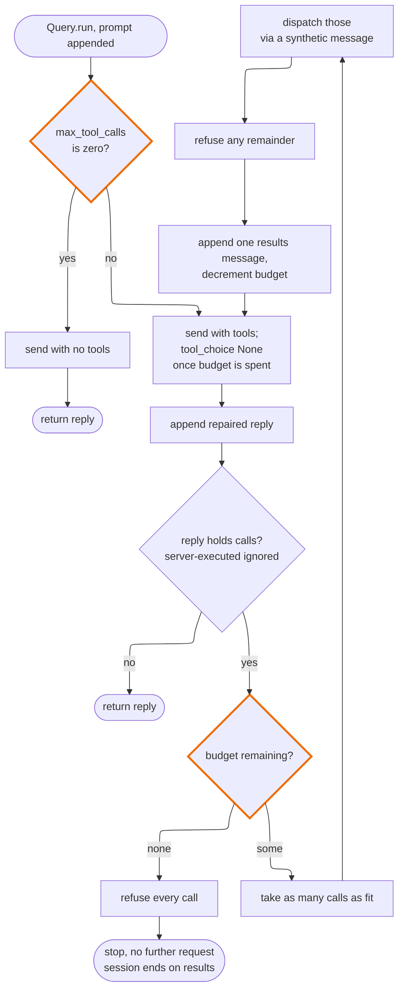
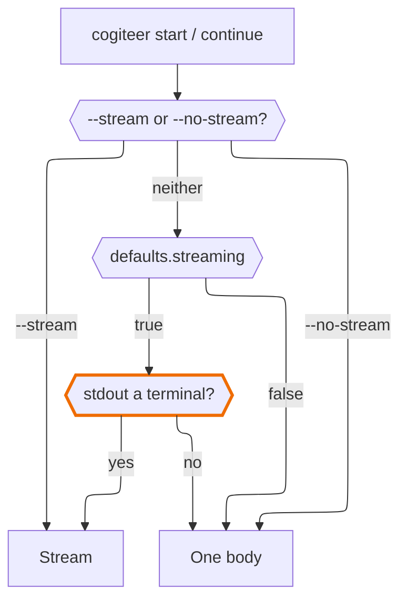
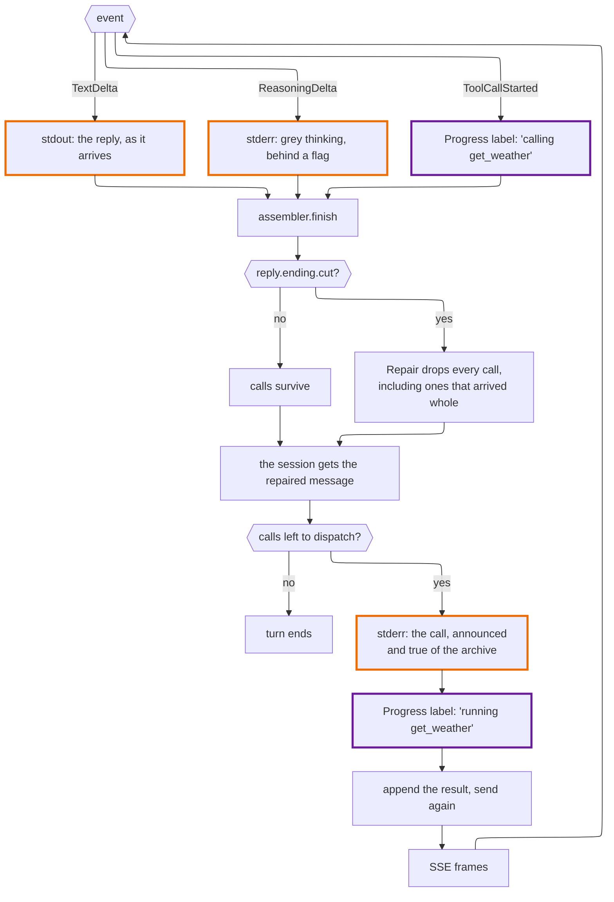

# Design

**Status**: `src/cogiteer/` and `src/main.cr` now exist — `start`, `continue`,
`list`, `show`, `prune` and `delete` are built, with streaming. What follows is
still the record of *why*, kept current rather than archived, so a decision made
once in conversation doesn't get silently re-made differently later.

**Scope**: The `cogiteer` executable — config resolution, deployment naming,
session storage, and the verb grammar. Does not cover the `Archive` format
itself or the session tree/branching work the MPSH specification explicitly
defers; both are [`liaison`][liaison]'s, and this document does not restate
them.

[liaison]: https://github.com/ModelArmy/liaison.cr

---

## What this is, and what it deliberately is not

A non-interactive, single-shot CLI: one invocation, one call to a provider,
one saved result. Not a REPL, not an agent framework, not a place for the
deferred session-tree/scatter-gather work to land — if that ever wants a
sentence-like grammar, it's a different, later tool built *on* `liaison`, not
a reason to complicate this one now.

## Its own project, having started inside the shard

This CLI was built inside `liaison` itself, as a first-party executable and the
most direct demonstration of what the shard is for. It now lives here instead,
and the move was forced rather than chosen: the next feature — tool execution
backed by a sandboxed filesystem toolkit — needs a runtime dependency, and
`liaison`'s `shard.yml` deliberately has none. A library that a caller
`require`s should not transitively acquire a sandbox because the front door
wanted one. So the front door left.

What made that cheap is worth recording, because the original decision is the
reason and it was not made for this:

> `liaison_cli/` as a sibling directory to `liaison/` — rather than nested
> inside it — makes that boundary a fact about the filesystem, not just a
> convention within a shared tree: `require "liaison"` touches zero files under
> `liaison_cli/`, provably, not just by agreement.

That was written to keep config-file parsing and session-folder conventions out
of what a library consumer gets. It turned out to also be the seam the split ran
along: the migration was a rename and a `require` change, with no logic touched,
because there was nothing to untangle. A boundary enforced by the filesystem
survives being tested in a way a boundary enforced by agreement does not.

```
src/cogiteer/            # config, session-folder naming, commands
  config.cr
  sessions.cr
  query.cr
  output.cr
  display.cr
  progress.cr
  commands/
    start.cr
    continue.cr
    list.cr
    show.cr
    prune.cr
    delete.cr
src/main.cr              # thin entrypoint: verb dispatch, error handling, done
```

`liaison` is now an ordinary `dependencies:` entry, and everything here lives in
the `Cogiteer` namespace. The one thing that did *not* come across is
`spec/end_to_end/`, which stayed behind on purpose: these specs were the shard's
only full-stack coverage, and that coverage is `liaison`'s to keep whether or
not this tool exists.

## Verbs: `start`, `continue`

```
cogiteer start anthropic "What color is the sky on Mars?"    → SESSID
cogiteer continue SESSID "Why is that?"
cogiteer continue SESSID "Why is that?" --on azure-mini
```

Considered and rejected: `ask` (with `--continue` as a flag), and a
SQL-like "everything after `cogiteer` is one query" grammar.

- **`start`/`continue` over `ask`/`--continue`.** Continuing is a first-class
  operation on a conversation, not a modifier on asking — it deserves its own
  verb. `start` was chosen over `new` because it pairs with `continue` on the
  same axis (two things you can do to a conversation over time), where `new`
  pulls toward a noun-first grammar (`session new`) that isn't the one this
  tool uses anywhere else.
- **Verb-first over a sentence grammar.** SQL's "read the whole thing as one
  query" earns its complexity because SQL queries are genuinely
  compositional — joins, subqueries, an open-ended space. `cogiteer`'s
  operations are a small, fixed, enumerable set. A sentence grammar needs a
  real parser and fights shell tab-completion and scripting for no benefit
  this tool actually has. `git`, `docker`, `kubectl` all converged on
  verb-first for the same reason.
- **`--on` stays a flag**, not a third verb, because which deployment to
  continue *on* is genuinely optional and orthogonal — continuing itself is
  not.

Both verbs are thin wrappers over one shared operation — `Cogiteer::Query.run`,
in `cogiteer/query.cr` — which resolves a `Provider`, appends the prompt,
calls `Client#send`, hands back the reply and report.

## Config: `cogiteer.yaml`

Search order: `$COGITEER_CONFIG` if set — the literal path, no search — else
`$CWD/cogiteer.yaml`, then `$HOME/cogiteer.yaml`. Explicit beats implicit: an
env var naming the file directly always wins over guessing from what
happens to exist.

Two tables and a block. A **server** is somewhere to send requests and the
protocol it speaks; a **deployment** is a named way to reach one model on one
server; **defaults** is how the CLI itself behaves, which is the third question
and belongs to neither of the first two.

```yaml
defaults:
  streaming: false
  show_reasoning: false

servers:
  anthropic:
    protocol: anthropic
    url: https://api.anthropic.com
    credential_env: ANTHROPIC_API_KEY

  azure-alpha:
    protocol: chat_completions
    url: https://oxaro-alpha.openai.azure.com
    credential_env: AZURE_OPENAI_API_KEY
    max_tokens_field: max_completion_tokens
    azure:
      api_version: "2025-04-01-preview"

  home-ollama:
    protocol: chat_completions
    url: http://localhost:11434

deployments:
  haiku:
    server: anthropic
    model: claude-haiku-4-5

  azure-mini:
    server: azure-alpha
    model: gpt5.4mini

  qwen:
    server: home-ollama
    model: qwen3.8
    reasoning: none

  gemma:
    server: home-ollama
    model: gemma4-27b
    reasoning_retention: completed_turns
```

Credentials are referenced by environment variable name, never stored in the
file.

### `defaults`: how the CLI behaves

No key here describes where a request goes or what is asked of a model, which
is why they are not on a server or a deployment. They describe what the CLI
does while an answer is being got.

Key                 |Default|Flag                                             |Means                                                 
--------------------|-------|-------------------------------------------------|------------------------------------------------------
`streaming`         |`false`|`--stream`, `--no-stream`                        |Show the reply as it arrives                          
`show_reasoning`    |`false`|`--show-reasoning`, `--hide-reasoning`           |Put reasoning deltas on stderr as they arrive         
`max_tool_calls`    |`50`   |`--max-tool-calls`                               |Ceiling on tool calls in one turn; `0` offers no tools
`tools`             |absent |`--tools`                                        |Which tools to offer; absent is all, `[]` is none     
`reproducible_tools`|`false`|`--reproducible-tools`, `--no-reproducible-tools`|Omit when and where a tool call ran                   
`web`               |`none` |`--web`, `--no-web`                              |Whether a turn may reach the network                  

**Every key here pairs with a flag of the same name**, and that is the rule the
block is held to rather than a coincidence. A key with no flag behind it is how
a section like this turns into a junk drawer, and a key spelled differently
from its flag is a translation table someone has to keep in step with `--help`.

The rule runs one way. A flag needs no key, and `--no-edit` has none: it
exists to make a configured tool set safe for one run without editing the
configuration, and a key would be that edit. `--id` and `--on` are the same
shape — facts about one invocation, not about how the CLI behaves.

`web` is the counter-case, and worth saying why it earns a key where
`--no-edit` does not. `--no-edit` subtracts for one run from a set the
operator already chose; `web` decides whether a capability is available at
all, which is a standing decision about a machine rather than a fact about one
invocation. It is two words rather than a boolean — `none` and `any` — because
the state an operator will want next is a list of permitted hosts, and a
`Bool` has nowhere to put one. **`off` is not a spelling**, for the reason
`reasoning` gives below: YAML 1.1 reads a bare `off` as boolean false, so it
would arrive as the wrong type and fail confusingly.

The two flags default to false, which is what the CLI did before the block
existed. `max_tool_calls` is the one key whose default is not the old
behaviour: tools are offered unless a `cogiteer.yaml` says otherwise, and `0`
is how it says otherwise. The argument for that default, and for counting
calls rather than rounds, is in *Tools* below.

Absent is not zero. `parse_flag` can treat a missing key as `false` because
nobody asks for `false` by omission, but `0` is a thing an operator means, so
`parse_count` takes the built-in as a fallback rather than letting the empty
case double as a value.

Precedence — flag, then this block, then a terminal test — is in *Streaming*
below, along with the one asymmetry in it worth arguing about.

### Model preferences: `reasoning` and `reasoning_retention`

Both optional, both per deployment, both absent by default.

`reasoning` takes `low`, `medium`, `high`, `xhigh`, `max`, `none`, or a
positive integer token budget. `none` asks the model not to think; leaving
the key out asks nothing and leaves the provider's own default alone. The two
are genuinely different, and the distinction is load-bearing — an absent
`Options#reasoning` emits nothing on any protocol, so a deployment that
configures neither produces the same request body it produced before either
option existed, and no recorded transcript is re-cut.

There is no `off` spelling. YAML 1.1 reads a bare `off` as boolean false, so
`reasoning: off` would arrive as a bool and fail somewhere unhelpful. Rather
than accept a quoted `"off"` and carry two spellings for one thing, there is
one word — `none` — and a bare boolean gets an error saying so.

`reasoning_retention` takes `all`, `completed_turns`, or `none`, mapping
straight onto `Capability::ReasoningRetention`. `completed_turns` replays
reasoning only for the turn in progress and drops it from closed ones, which
is what some model cards ask for.

The `none` under each key means a different thing — one asks the model not to
produce reasoning, the other drops reasoning out of the history being
replayed. They share a word because it is the honest word for each key.

### Why these are configuration and not a catalog

`Capability::Catalog` already holds model-specific facts, and these
deliberately do not go in it. The line is between **hard protocol facts** and
**soft quality preferences**:

&nbsp;      |`SIGNED_TOOL_CALLS`|`reasoning`, `reasoning_retention`
------------|-------------------|----------------------------------
Wrong ⇒     |400, request fails |Answers are merely worse          
Authority   |The vendor's API   |A model card, read by the operator
Disagreement|Not reasonable     |Perfectly reasonable              
Lives in    |Code               |`cogiteer.yaml`                   

Facts that break requests are ours to get right. Preferences someone read off
a model card are theirs to state — and stating them in config means adding a
model never requires a release, which for locally served models is most of the
point. This settles the question `Capability::Retention` had parked.

### Why the split

One flat table meant a local Ollama serving six models repeated its URL and
protocol six times. Worse, everything awkward about that table turned out to
be a **server fact wearing a model entry's clothes** — which is why this one
change fixes two complaints rather than one.

`azure` is the clearest case. It was a boolean on a deployment, paired with
an `api_version` that had to accompany it; "azure with no api_version" was
writable and failed at provider-construction time. Nested on the server it is
present or absent, `api_version` is non-nilable, and the bad shape cannot be
written down. It also now sits on the thing it describes: Azure is about
where a request goes and how it is addressed, not about which model answers.

`max_tokens_field` moved for the same reason. `Provider.for_azure` already
rejects it on anything but ChatCompletions, which makes it a fact about the
protocol — and protocol is now a property of the endpoint.

### One behavioural change: whose name the vendor claim follows

`Provider.for`'s vendor default compares the `Server`'s name against the
protocol's canonical vendor, so a server called `anthropic` is treated as
authentically Anthropic. That name used to come from the *deployment*, which
meant `haiku` and `sonnet` were two different vendor identities for one
endpoint. It now comes from the server entry, which is the right way round:
the vendor claim is a fact about the endpoint.

### The old format is rejected, not accommodated

An old config says `server: https://…` on the deployment itself. Under the
new shape that parses as a reference to a server *named* after a URL, and
would fail with an accurate and useless "no server named
`http://localhost:11434`". `Config` sniffs for the old shape once at load and
raises something that says what to change.

Deliberately not supported as an alternative form. Accepting both forever
would mean `server:` means two different things depending on whether it
contains `://` — exactly the kind of cleverness this restructure exists to
remove.

### Naming a session: `--id`

`cogiteer start <deployment> <prompt...> [--id <session-id>]`. Absent, a name is
generated as before.

For anyone driving `cogiteer` from a script, who would rather the session be
called `nightly-summary` than have to capture whatever two words came out. It
is also the honest answer to running out of generated names: 31 adjectives by
30 nouns is 930, comfortable to around 500 stored sessions and deteriorating
past 700, and someone creating sessions in bulk was always better served by a
meaningful name than by a bigger word list.

**An existing id is refused, not continued.** `start` means start, and
silently appending to a conversation because a script reused a name is the
kind of surprise that costs someone a day. The error points at `continue`,
which says what it does.

The generator also stopped being able to fail. It used to raise after twenty
colliding tries; it now falls back to numbering — `brisk-comet-2` — but only
once the two-word space is genuinely crowded, so the first several hundred
sessions pay nothing for it. A random suffix on every name would have taxed
day one to protect against a problem most users never reach.

### Session ids are validated, because they always were user input

Letters, digits, dot, dash and underscore, starting with a letter or digit, 64
characters at most, and no `..`.

`continue SESSID` and `show SESSID` have always taken an id straight from
argv, and `path_for` joined it unchecked — so `cogiteer show ../../somewhere`
walked out of the sessions folder. `--id` makes that a write path too, which
is what prompted the fix, but the hole predates it.

Enforced inside `path_for` rather than at each call site: an id becomes
dangerous at exactly the moment it becomes a path, so that is the one place a
future verb cannot forget to check.

`Sessions.valid_id?` is the same question without the exception, for callers
*enumerating* the folder rather than being handed an id. The two situations
are genuinely different: an id from argv that fails validation is a mistake
worth reporting, while a directory entry that fails is debris. `list` uses the
predicate, having first shipped without it and fallen over a `.DS_Store`.

## Session storage

`$COGITEER_HOME` if set, else `$CWD/.cogiteer` if it exists, else
`$HOME/.cogiteer`.
Promoted to first once `Config` needed the same escape hatch for
`$COGITEER_CONFIG` — an explicit path someone actually pulled up should not
lose to whatever `.cogiteer` a real invocation happened to leave sitting in
`$CWD` or `$HOME`, and that's exactly what only checking `$CWD` first could
not offer. A `sessions/` subfolder, one folder per session.

Session IDs: generated, short, memorable — adjective-noun pairs (`brisk-comet`)
over a hash prefix, for the same reason git branch names and Docker container
names do this. Collision handling is a retry-on-directory-exists, nothing
cleverer.

Storage is snapshot-per-turn, not an append-only diff log: `Session`'s own
`Archive` form is already a complete point-in-time record — MPSH rebuilds
the full request from the whole history on every call regardless — so a
session's true state at any point already *is* a full snapshot, and storing
anything less would mean reconstructing what's already free to keep. Each
`continue` writes a new timestamped file into the session's folder; nothing
is overwritten. A future `--no-history` (or similar) to overwrite instead is
cheap to add later and isn't designed in now.

Filenames carry the deployment name, not just a timestamp —
`<unix_ms>-<deployment>.json`. This is what makes `continue SESSID "..."`
work with no flag at all: it reuses whichever deployment last answered
*this* session, read straight off the last snapshot's filename. There is no
`default_deployment` in `cogiteer.yaml` for this to fall back to, on purpose —
an earlier version of this design had one, and it was wrong in a way that
only showed up with two configured deployments in play: it answered "what do
I usually want," a fact about the config, when what `continue` actually
needs is "what was this conversation already having," a fact about the
session. A global default silently aims a continued conversation at
whatever the config happens to prefer, which has nothing to do with where
that conversation was. Switching deployments remains exactly as deliberate
as it already was — `--on` — but staying on the same one is now free and
correct by default, rather than requiring the same flag every single time.

A snapshot written before this existed has no deployment segment in its
filename. Treated as genuinely unknown rather than guessed at: `continue`
against one of these asks for `--on` once, and every snapshot after that
carries the answer.

### What is archived is repaired; what is printed is what arrived

A turn can end early — an output cap, a dropped connection — and a turn that
ended early can hold a tool call the model never finished planning.
`MPSH::Repair` drops those calls and keeps the text. The CLI applies it in two
places, and the two are not the same decision.

**On append**, in `Query`: the message that goes into the snapshot is the
repaired one, and the message handed back for printing is the unrepaired one.
A dangling call in a snapshot is a session nothing can continue — not this CLI,
not another one, not another provider — which is the single property the
archive exists to protect. But a person is entitled to see what the model
actually said before it was cut, so the screen gets that.

**On load**, in `continue`: a snapshot may have been written by a build that
predates repair, or by something else entirely, since the whole point of this
format is that other things can write it. One pass over messages already in
memory, and it says so on stderr — quietly fixing a file someone may be
reasoning about is worse than one line of explanation.

A cut turn that produced nothing but tool calls repairs to nothing, and nothing
is appended. The user's prompt stays: it was asked, and the next turn reads
better with the question in it than without.

The cut itself is reported by `Output.warn_cut`, on stderr, and deliberately
*not* through `warn_lossy`. A fidelity annotation means damage this shard's
mapping inflicted. An interrupted turn is something that happened to the
connection or the model. Routing the second through the channel built for the
first makes the channel mean less, which is the failure mode the annotation
design exists to avoid.

## Verbs: `list`, `show`, `prune`, `delete`

```
cogiteer list                                → one line per session
cogiteer show SESSID                         → the transcript
cogiteer show SESSID --snapshots             → the append-only turn history
cogiteer show SESSID --json                  → the stored archive, verbatim
cogiteer prune SESSID --keep N               → trim to the newest N snapshots
cogiteer delete SESSID                       → remove the session outright
```

Four verbs that touch no network, which makes them the only commands here
fully testable without a recording. Two read, two remove.

### Turns and snapshots are not the same number

`list` reports turns; `show --snapshots` reports save points. In the ordinary
case they agree — one `start` or `continue` writes one snapshot and adds one
genuine user input — which is why `list` counting `messages.size` went unnoticed
until someone compared the two and saw ten against five.

They can legitimately differ, because **a snapshot is a complete archive rather
than a delta**. Snapshot five is not turn five; it is the whole conversation as
of turn five. So `prune --keep 1` shortens no conversation at all: the surviving
snapshot still holds every turn, and what is lost is the ability to read the
session as it stood earlier. A pruned session therefore shows many turns and few
snapshots, correctly. The reverse — one snapshot holding a long conversation —
is possible for an archive placed by hand, though nothing in the CLI produces it.

The turn count itself defers to `MPSH::Turns`, which already knows the subtlety
that a tool result is a user-role message but not user *input*, so a
call-and-result exchange stays inside the turn that prompted it.

### Removing things

Two verbs rather than one with a mode flag. `delete` and `prune` have very
different blast radii, and behind a flag on `delete` a mistyped flag is a lost
conversation rather than a lost turn or two. Separate words also match the
grammar, which is all plain verbs.

**Naming the id is the confirmation.** No prompt, and no `--yes` to dismiss
one. This CLI is non-interactive and single-shot, prompting needs a stdin the
recorded-command specs do not have, and `rm foo` does not ask either. That
posture holds only while the blast radius is one typed name, so there is no
`--all`, no glob and no bulk mode; a verb that could remove an unknown number
of sessions would need a different answer to the confirmation question, and
would be a different verb.

**`--keep` has no default and must be at least one.** Every value is a
judgement about how much history is worth keeping. A session with no snapshots
is indistinguishable from a corrupt one, and `delete` is the verb for meaning
that.

**Neither verb parses an archive.** They work from filenames alone. An
unreadable session is among the likeliest reasons to want one gone — `list`
already renders those as `<unreadable>` — and a delete that insisted on
reading what it was about to remove would fail exactly when it was most
wanted.

**Both report to stderr**, with the session id and the fidelity warnings,
rather than to stdout with the listings: a receipt for work already done is
information about the invocation, not the thing you would pipe somewhere.

Pruning is only meaningful because `Sessions.snapshots` is genuinely
chronological, which is newer than it looks. Before `snapshot` began bumping
shared milliseconds, "the newest three" was a lexical accident that could name
the wrong file.

**Every block is rendered, not just the text ones.** `Message#text`
concatenates text blocks and drops the rest — correct for printing a reply,
wrong for an inspection verb. A transcript that silently omitted tool calls
and reasoning would misrepresent precisely the sessions this shard exists to
carry between providers, and would be most convincing on the ones that matter
most. Non-text blocks get a bracketed one-line descriptor (`Output.describe`)
— enough to know a block is there and what it is, without dumping base64 into
a terminal.

**`--snapshots` exists because the storage design is otherwise invisible.** A
transcript only ever shows the newest snapshot, so nothing in the CLI would
reveal that every `continue` appends rather than overwrites. That is a design
decision worth being able to see.

**`--json` emits the file's own bytes, not `Archive.write(Archive.read(...))`.**
A read-then-write would put this command's understanding of the format between
the person and their data, and quietly rewrite anything it did not understand.
The portable artefact is the point of the shard; handing it over should not
require knowing the folder convention, nor risk a lossy round trip on the way
out.

**Listing is deliberately cheap.** One file read per session — the newest
snapshot, which is already a complete point-in-time record, so turn count and
opening prompt come free from a read that also proves the session is intact. A
folder with no snapshots (what a crashed `start` leaves) is skipped, and one
that will not parse is reported inline rather than fatally: a corrupt session
should cost you that session, not the ability to find the other nineteen.

**`Output` gained an injectable stream** (`Output.stream`, `Output.error_stream`).
`start`/`continue` never needed one — their observable effect is a file on
disk. For `list` and `show` the output *is* the behaviour, so without a seam
they could only be tested by asserting they did not raise, which is not a test.

It turned out to be worth having for `start`/`continue` after all, for a
different reason: a `crystal spec` run was buried under the replies of every
recorded command. `spec/support/cli_output.cr` redirects both streams for the
duration of a block, and the two live command specs wrap their sandbox in it.

`Progress` is the reason `Output` had to become the *single* switch rather
than merely a switch. It draws whenever its stream is a terminal, and a spec
run in a terminal is one — so silencing `Output` alone would have left the
spinner ticking over the transcripts. `start`/`continue` therefore hand
`Progress` the `Output.error_stream` rather than `STDERR` directly.

The one thing still writing to the real streams is `src/main.cr`, the
executable's own usage and error reporting. That is the process boundary, no
spec invokes it, and routing it through `Output` would buy nothing.

## Waiting: a ticker, not an event queue

`start` and `continue` block on one HTTP round trip with nothing to print.
Without an indicator that reads as *slow*, not *stuck* — especially against a
local Ollama, where thirty seconds is normal and indistinguishable from a hang.

`Progress` spawns a fiber that wakes every `TICK` (250ms) and redraws a
spinner and an elapsed-second count. **Elapsed seconds are the point**; a
spinner alone says the process is alive, `23s` says whether the model is slow
or the endpoint is hanging, which is the question actually being asked.

**On stderr, and only when stderr is a terminal.** The stdout rule above
exists so `cogiteer start ollama "..." > answer.txt` works, and a spinner on
stdout would corrupt that file. Redirected stderr is a log or a CI transcript,
where a few hundred carriage returns are worse than no indicator, so
`STDERR.tty?` gates the whole thing to a no-op.

### Why not an event queue

The natural design is for the library to emit progress events and the CLI to
render them — correct *when there are events*, which is to say once streaming
lands. Today there is one thing to report and its source is a clock, not the
server. A queue would build half of streaming's architecture against a library
with no seam to feed it, delivering none of streaming's benefit. `Liaison::Client`
is untouched by this and stays headless.

### What streaming will want from it

Streaming does not retire the ticker. Chunks arrive that cannot be shown — a
tool call spread over several deltas has to be aggregated before it is
parseable, and during that aggregation the CLI is waiting with nothing to
print again. The indicator survives; it gets started and stopped repeatedly
within one turn rather than wrapping the whole call.

Two accommodations, both free:

- `#start`/`#stop` are public and `.while_waiting` is a convenience built on
  them, so the block form is not the only door.
- `#label` is mutable, so a caller mid-stream can say what it is waiting *for*
  ("aggregating tool call") without tearing the indicator down. This is the
  part of the event-queue idea worth keeping, at none of its cost.

**Known limit:** Crystal's sockets are non-blocking and yield to the
scheduler, so ticks continue through the HTTP round trip. DNS resolution is
the exception — `getaddrinfo` can block the thread, so on a cold cache the
spinner may pause briefly before the request proper begins. It is short, it
is before the slow part, and engineering around it would cost more than it
returns. Recorded so it is not rediscovered as a bug.

## Deliberately deferred, not forgotten

- **Tool execution.** Built; see *Tools* below. What is still deferred from it:
  an operator-settable sandbox root, and a config key for the message a refused
  call carries.

## Tools

The CLI gives a model filesystem tools, rooted at the directory it was run in,
and runs them itself. `max_tool_calls: 0` turns that off and reduces a turn to
the single exchange it was before any of this existed.

### Why `FsUtils::Tools`, and not its helpers

[`fsutils`][fsutils] offers two layers: `Find`, `Grep`, `Reader`, `Writer` and
`Replacer`, and a `Tools` layer above them. The obvious instinct is that tool
calling belongs near the agent, and that taking the upper layer puts a foreign
opinion about tool calling inside this project.

It does not, because that layer contains no tool calling. There is no protocol
in it, no dispatch loop, no turn, no `is_error`, no notion of a model reply —
`Definition` deliberately hands over three plain strings rather than a
vendor-shaped blob, and `Tools#call` takes named arguments and returns a
response. What the layer actually holds is sandbox confinement, strict argument
extraction, an output-byte budget, a common envelope, and the prose a model
reads when something goes wrong.

None of that is specific to this application, and all of it is work the next
host would repeat. Writing it here would move roughly 1,700 lines and 1,500
lines of its tests into a place where nobody is watching them, the sandbox
most of all: resolve-then-compare, a separator check so `/srv/project-secrets`
cannot pass for root `/srv/project`, canonicalising only the existing prefix so
a missing file reports honestly. Reimplementing that is the same work done once
more, less well tested.

The one thing the upper layer costs is tool naming, which it does not let a
host change. Nothing here wants to, and if that changes it is a request to that
shard rather than a reason to own the layer.

### The adapter owns the seam, and neither library should close it

A model's arguments arrive as `MPSH::Object` and are wanted as
`Hash(String, JSON::Any)`. The two libraries disagree on purpose. `MPSH::Value`
exists so canonical types carry no parse artifact; `FsUtils::Tools::Arguments`
takes `JSON::Any` so a model's mistake — `max_matches: "200"` — survives far
enough into that shard to be refused there, in its own vocabulary, with its own
suggestion.

Both are right locally, so the conversion lives here. The tempting fixes are
both library changes whose only beneficiary is this caller: a `Value#to_json_any`
would put a serialization identity back into the types that exist to avoid one,
and typed argument structs on the far side would move rejection into the host
and break that layer's promise never to raise for anything a model can fix.

The conversion is total — every arm of `MPSH::Value` has a `JSON::Any`
counterpart — so nothing is lost and it cannot fail. `Int64` stays `Int64`,
which is what a schema's `integer` is read from downstream.

### Failure is a raise, because that is what sets `is_error`

`FsUtils` reports failure inside the body as `ok: false`. Every protocol carries
it on the block instead. Left alone, a model would see a successful tool result
whose body said otherwise.

`Function#call` returns blocks and cannot set the flag; `Toolbox` builds the
result block and sets `is_error` when the call raises. So the adapter raises
`Function::Failure` carrying the **whole envelope**, not just `error.message` —
the code and the suggestion are the parts a model acts on.

### The ceiling counts calls, not rounds

A turn is bounded, because a model asking for one more file each time is
otherwise unbounded. The unit is the whole turn's calls.

Counting rounds is the tempting alternative, since cost is dominated by
requests: each round resends the entire conversation, so a hundred rounds of
one call costs far more than ten rounds of ten. But every round holds at least
one call, so **a cap on calls bounds rounds as well** — where a cap on rounds
leaves a single round free to make a hundred calls, and it is calls, not
rounds, that put tool results into the context.

The cost is that width and depth share one budget: a model opening with a wide
parallel search has less left to iterate with. That is why the default is 50
rather than 10. This is a ceiling on a runaway, not a budget to be spent, and
an honest turn should never reach it.

A round that does not fit is **split, not refused**. As many calls run as the
budget allows and the rest come back refused, in the same message. Refusing the
whole round would throw away work the model correctly asked for, and the
refusal block has to exist for the other case anyway.

`Toolbox#dispatch` runs every call in the message it is given and keeps `run`
private, so a partial round cannot go through it. The runnable calls are passed
as a synthetic assistant message; the refusals are paired to their `call_id` by
hand. Server-executed calls are neither counted nor run — the provider ran
them, and charging a budget for work this process did not do could exhaust it
without a single local call.

### Two endings, and why the second one exists

Once the budget is spent, the next request still declares the tools and adds
`tool_choice: None`. Dropping the tools instead would be a stronger guarantee
and is not available: on Anthropic, a request whose history holds tool blocks
and whose tool list is empty is rejected outright. It would also invalidate the
prefix cache from position zero, on the largest history the turn will ever have.

A provider that honours the choice replies in prose, and the turn ends with a
summary the user can resume from. That is the intended ending and it is what
`spec/cogiteer/tools/anthropic_tools_spec.cr` records.

A provider that ignores it replies with more calls. Those are refused, appended,
and the loop stops without a further request — so the session ends on a
user-role message of tool results. That is sendable: `Repair.sendable?` asks
only that every call has a result, and `Capability::Structural`'s
`MergeConsecutiveRoles` already exists for the two consecutive user messages a
later `continue` produces. What is lost is the closing prose, not the session.

**Enforcement is a property of the server, not of the protocol.** Gemini is
documented as ignoring the choice once a conversation holds a function call.
Ollama's chat-completions endpoint does not implement `tool_choice` at all, and
answers a `"none"` with a call — so a local deployment behaves like Gemini over
a protocol that is otherwise strict about it. The loop therefore checks the
reply rather than trusting the request, on every protocol.



### Choosing what is offered

`tools` narrows the set; two gates then subtract from whatever it left, and
both win over it. An absent `tools` offers everything `fsutils` has except the
network tools, so a tool the toolkit gains arrives without a change here; `[]`
offers nothing, which an operator can mean. A name the toolkit does not offer
raises: a typo that silently dropped a tool would leave a model unable to do
something, with nothing to read explaining why.

Naming a tool a gate then drops offers nothing rather than raising. It is the
same decision as `--no-edit` beating `tools`, read one step further: a gate
that a config could argue with is not a gate.

Whether a tool writes is declared in `Workspace::CAPABILITIES`, because
`FsUtils::Definition` says nothing about it. **A name missing from that table
counts as writing.** This looks like an oversight and is not.

Option                  |After `shards update` adds a tool                           
------------------------|------------------------------------------------------------
Raise on an unknown name|The CLI will not start, for every command                   
Count it as reading     |`--no-edit` offers a tool that might write                  
**Count it as writing** |Kept out of `--no-edit`; offered to a run that asked for all

Raising punishes the user for a decision the maintainer has not made yet.
Counting it as reading fails open on the one flag whose whole promise is not
failing open. Counting it as writing fails closed and keeps working.

The decision still gets made, and the suite forces it: `workspace_spec.cr`
asserts every definition is classified, so the update that introduces a tool
fails this project's tests — which is when someone should decide what it is,
rather than when a user meets it.

### Four capabilities, because one enum was carrying two questions

`Capability` began as `Read` and `Write` over one tree, which held for exactly
as long as every tool was a filesystem tool. `fetch_as_markdown` broke it in
two directions at once: it leaves the machine, and when a page is too large to
return inline it writes the content to a scratch directory. Classified with
what existed, it was either a read — and `--readonly` would have handed a model
egress and a file it could create — or a write, and the most useful thing a
no-edit run could do would have been unavailable.

Member   |Means                                                               
---------|--------------------------------------------------------------------
`Read`   |Reads the tree                                                      
`Write`  |Changes files the user owns — the thing an operator is protecting   
`Scratch`|Writes only inside a directory the tool created and nobody asked for
`Network`|Leaves the machine                                                  

The table says what a tool *touches*; which of those an operator allows is the
flags' question. Keeping them apart is what lets `workspace_spec.cr` check the
table against the toolkit, and what made `--no-edit` need no change when
`Network` arrived: it already tested the member it meant.

### `--readonly` became `--no-edit`, because the old word claimed too much

The flag never meant "reads only" and now visibly does not: it permits a tool
that reaches the internet. Nor can it promise nothing changed — a `GET` may
well be a mutation at the far end, and nothing here can know. What it can
promise, and all it can promise, is **your files are as you left them**, which
is what the new name says. `--safe` was considered and rejected for implying
security guarantees this makes none of.

The old spelling was dropped rather than aliased. The project carries a
work-in-progress warning, and two names for one flag is the kind of kindness
that outlives its reason.

### Web access is asked for, never inherited

Every other gate subtracts from what was asked for. `web` is the one that must
be asked for, and the asymmetry is deliberate: `fsutils` opens `fetch` to every
public host unless a policy narrows it, so a default of `any` would mean a
`shards update` could turn on egress for every existing `cogiteer.yaml`.

`none` does not offer the tool, rather than offering it and refusing every URL.
A refusal costs a call out of the budget and teaches a model something it
cannot act on — `fsutils` gives the empty-allowlist refusal its own "stop, do
not retry" suggestion precisely because it is unfixable from the model's side.

The scratch directory is the part a user meets without asking for it: a long
page lands in `.agent-scratch/` under the working directory, and nothing prunes
it. `fsutils` keeps it out of `find_files` and `search_file_contents`, so it
does not pollute a search, but it is the user's to clean up and `README.md`
says so where someone will read it before turning the tool on.

`reproducible_tools` drops a walk's `elapsed_ms` and a find result's `modified`.
Off by default, because an mtime is how a model notices a file changed under
it; on wherever two runs of one prompt must agree, which is every recorded
spec.

### Built per invocation, never memoised

`FsUtils::Tools` fixes its sandbox root at construction, and `Liaison::Function`
warns separately that instances outlive a call and leak between sessions. This
process runs one session and exits, which makes a memoised toolbox safe by
accident. `Query.run` builds it instead, so it is safe on purpose.

### What the terminal shows while a call is in flight

Nothing durable. The ticker relabels; `Output.reply` prints text blocks and not
calls. *Printed bytes precede repair* settled this before there was anything to
apply it to, and it is why a streamed run and its saved session still agree
exactly.

## Streaming

Decided before the first assembler and built after the last one, which is the
order this shard keeps: a library that ships a CLI to prove itself cannot let
the CLI answer the library's design questions by accident.

`Display` resolves what the terminal does; `Query` runs the streamed turn;
`Output` prints it. The sections below are the reasoning, and all of it is now
load-bearing rather than prospective.

### `defaults.streaming`, then a tty test on stdout

**Off unless asked for.** `defaults.streaming` is false, which is what the CLI
did before the key existed. A configuration written today keeps meaning what it
meant.

**With it on, stream when `stdout` is a terminal.** Not stderr. `Progress` asks
`STDERR.tty?` because it *writes* to stderr; deltas write to stdout, so the
analogous rule is the same question asked of the other stream. Copying the
expression rather than the rule would stream into a file under
`cogiteer start ollama "…" > answer.txt 2>&1`, where stderr is a terminal and
stdout is not.

**`--stream` and `--no-stream` override both, and win.** Not decoration: it is
how both modes get recorded per protocol, and it is the escape hatch the
library's own design argues for — the caller who has just asked for a very
large output and would rather the connection stayed warm.

The order is therefore flag, then configuration, then the terminal test — with
one asymmetry that is deliberate. **The tty test is a floor that configuration
does not lift.** `defaults.streaming: true` is a preference about how this
person likes to watch answers arrive; it is not a claim that a cron job
redirecting stdout into a file wants a failure mode it cannot see. `--stream`
goes through the floor, because a flag is typed with the specific run in view.
The cost is one surprise the first time someone with `streaming: true`
redirects output and notices it did not stream; the alternative is a silent new
truncation class in exactly the runs nobody is watching.



### Transport follows rendering

A redirected run displays nothing incrementally, so streaming buys it nothing
— while costing it a failure class it does not otherwise have. The stream that
ends without its terminal frame — class 3 in `liaison`'s own scope notes —
**exists only when you stream**. Accepting a new way to be silently truncated
in exchange for no visible benefit is a bad trade, so the non-tty path asks for
one body.

### Printed bytes precede repair

This is the load-bearing argument for the tty rule, and it is stronger than
"a person is probably watching".

Repair operates on the assembled message and may remove content from it — a
dangling tool call, most obviously. Repair cannot un-print. Streaming to stdout
is reading a page as it comes off the press: fine when you are standing there
and can see the correction slip, less fine when you wanted the corrected
edition.

The tty rule confines that irreversibility to the terminal, where a person can
see what happened and a stderr warning reaches them. Redirected stdout — the
thing a script consumes — is never streamed, so it always receives the repaired
reply. Streaming and non-streaming stdout are therefore not quite the same
artifact, and this is the sentence that says so out loud rather than leaving it
to be found.

**The hazard is prospective, and a reader who goes looking for it today will
not find it.** Repair removes tool calls and keeps text; `Output.reply` prints
`Message#text`, which is text blocks only. So the one thing repair takes away
is the one thing stdout has never shown, and a streamed run and its saved
session agree exactly. That agreement is now asserted rather than described —
`spec/cogiteer/commands/streaming_spec.cr` compares streamed stdout to the
saved reply's text for equality — which is what turns this section from an
argument into a constraint.

So the rule is better stated as a property than as a guess about who is
watching: **the terminal is the only surface permitted to disagree with the
archive.**

#### Three surfaces, not two

An earlier version of this section predicted the hazard would arrive with tool
execution, "once the CLI narrates a call as it materialises — `→
get_weather(Paris)`, which is the natural use of `Progress`'s settable label."
That sentence names two different artifacts as one, and the difference decides
the whole design.

Surface              |Erasable|Must agree with the archive  
---------------------|--------|-----------------------------
stdout: the reply    |No      |Always                       
stderr: printed lines|No      |Yes, if durable              
`Progress`           |**Yes** |No — it leaves nothing behind

`Progress#stop` erases its line. A spinner is a light on a dashboard, not an
entry in a logbook, and the scenario this rule warns about — *scroll back
tomorrow and the screen disagrees with `cogiteer show`* — needs bytes that are
still there tomorrow. So the label version of that prediction cannot produce
the failure the prediction describes.

Which the CLI already relies on: `Query#stream` has handled `ToolCallStarted`
since streaming landed, by relabelling the ticker. A call that never finishes
leaves no trace, which is exactly what the archive will say happened. That
narration is correct as it stands and needs no rule to confine it.

#### The durable announcement lands after repair, not after `finish`

"Announce the call once the assembler has vouched for it" sounds sufficient and
is not. Repair drops **every** call on a cut turn, including calls that arrived
whole, because a complete-looking set may be half a parallel plan. And the
assemblers disagree about what reaches `finish` at all:

- Chat Completions materialises no calls on a cut. It has no per-call end
  signal, so arguments that merely look finished are the dangerous case.
- Anthropic materialises any `content_block_stop`-closed `tool_use`; Responses
  keeps every `response.output_item.done`.

So a stream cut after one finished call and mid-second leaves a reply carrying
a real `ToolCallBlock` on two protocols and none on the third — and repair
removes it on all three. Announce at `finish` and the terminal claims a call
the session does not hold, *and claims it differently depending on which vendor
answered*. Announce after repair and the durable line is a statement about the
archive by construction.

**The rule, stated so it can be applied rather than admired:** the terminal
announces a tool call at the moment the CLI commits to dispatching it, which is
after repair. The only surface permitted to mention a call that never made it
is the one that erases itself.

Two consequences follow, and both are cheaper to know than to discover.

**Dispatch reads the repaired message.** `Query.run` appends the repaired
message and returns the unrepaired one, for the reasons in *What is archived is
repaired*. A turn loop reading the returned reply would dispatch a call the
session does not contain and append a result whose call is missing — breaking
`Repair.sendable?` from the other direction, and doing it on exactly the cut
turns this whole arrangement exists for.

**Tool activity is stderr, so stdout stays text-only.** A call is a fact about
the invocation, not about the answer, which puts it on the same side of this
file's opening rule as the session id and the fidelity warnings. `Output.reply`
keeps printing `Message#text` and nothing else. Which means the tty floor now
rests primarily on *Transport follows rendering* — streaming buys a redirected
run nothing but a new truncation class — while this section stays a guard
against a hazard that has still not arrived. That is worth saying plainly,
because a reader will keep going looking for the discrepancy and keep not
finding it.



Bordered nodes are the surfaces that outlive the turn. The two in purple do
not, which is the only reason they may speak before repair has had its say.

### Reasoning is not the reply, and does not go to stdout

The library emits reasoning deltas under every retention setting — see
[`liaison`'s STREAMING_DESIGN.md][streaming-design] for why that is forced
rather than chosen. What the
CLI does with them is a separate question, and the answer preserves an existing
guarantee: `Output.reply` prints `Message#text`, which concatenates text blocks
only, so reasoning has never reached stdout. Streaming must not be the thing
that changes that.

So: **reasoning deltas go to stderr, behind `defaults.show_reasoning` and
`--show-reasoning`, off by default.** Someone who set `reasoning_retention: none` on a deployment and sees
no reasoning in their terminal gets what they expected — by way of the control
that actually governs display, rather than by the library second-guessing a
playback preference. Someone who wants to watch the model think asks for it.

### Whether the reply was streamed is read off the report, not the request

Both verbs print the reply with `Output.reply(reply) unless report.streamed?`,
and the temptation is to ask `display.streaming?` instead. It would be wrong.
A protocol with no streaming seam falls back to a single body inside
`Client#send`, having printed nothing on the way, and a request that *asked* to
stream is not evidence that anything was streamed. `Report#streamed` is set by
the path that actually ran. Ask the request and a fallback prints nothing at
all.

### `Progress` survives, as its own doc predicted

Up before the first delta, down on it, up again with a new `label` during the
stretches that cannot be shown — a tool call spread over several deltas has to
be aggregated before it is parseable. Started and stopped repeatedly within one
turn rather than wrapping the whole call. `#start`/`#stop` being public and
`#label` being mutable is exactly this, and no part of the interface needed
rewriting.

One line of the implementation did. `Progress` built its stop channels once, in
`initialize`, which is invisible while `while_waiting` is the only door: the
indicator goes up once and comes down once. Called twice, the second fiber
found a channel `stop` had already closed, took the break branch on its first
pass and drew nothing. The design anticipated being restarted; the code had
never been. Channels are now made per `start`.

[fsutils]: https://github.com/nogginly/fsutils.cr
[tool-execution]: https://github.com/ModelArmy/liaison.cr/blob/main/docs/TOOL_EXECUTION.md
[streaming-design]: https://github.com/ModelArmy/liaison.cr/blob/main/docs/STREAMING_DESIGN.md
